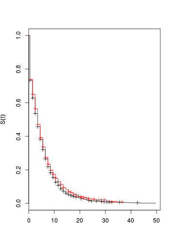
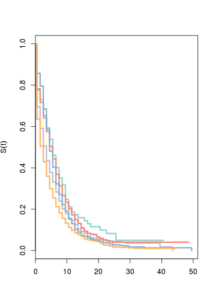

## Variables

nombre | descripcion
------ | -----------
TimePermCG | Tiempo permanencia
PermanentCG | variable de status: 1 tiene la plaza
Q6 | dicipline
Q23 | Sex
Q24 | Age
Q25 | Single
Q27 | Children (ver variable Parenthood tb )
Countryb | Country
foreign | Extranjero
foreignEdu2 | Si te has educado en un país extranjero
multidisc | Mobility disciplinar
publ_prod2 | Publications

## Lectura de datos desde fichero de stata

Con la librería foreign podemos leer datos de spss, stata, etc.


```r
library(foreign)
datos <- read.dta("../data/working_10_Cleaner.dta")
head( names(datos))
```

```
## [1] "Career_stage"      "CodeNumber_enc"    "CodeNumber"       
## [4] "Countryb"          "Current_Institute" "FieldofScience"
```

Nos quedamos sólo con las variables que nos hacen falta


```r
datos <- datos[,c("ability","Countryb","Q6","Q23","Q24","Q25","Q27",
						"Parenthood", "foreign", "foreignEdu2",
						"multidisc", "TimePermCG","PermanentCG",
						"mobilityPG2")]
```

La variable Countryb tiene como niveles todos los países, elimino las etiquetas de países que no están en los datos y elijo UK como el país de referencia 


```r
datos$Countryb <- droplevels(as.factor(as.character(datos$Countryb)))
datos$Countryb <- relevel(datos$Countryb,ref="united kingdom")
```

Defino la variable time como TimePermCG y status como PermanentCG


```r
datos$time <- datos$TimePermCG

datos$status <- datos$PermanentCG
```
Comprobamos si hay casos perdidos 


```r
sum( is.na( datos$time))
```

```
## [1] 36
```

```r
sum( is.na( datos$status))
```

```
## [1] 0
```

Eliminamos los perdidos en time


```r
datos <- datos[!is.na(datos$time),]
```

Tenemos observaciones censuradas, es decir, entrevistados que no han obtenido la plaza ni sabemos cuando la obtendrán. Unos 692


```r
table(datos$status)
```

```
## 
##    0    1 
##  692 5349
```

Por otro lado también tenemos entrevistados que en time=0 ya tienen la plaza (status=1), una posible solución es sumar 0.5 a time. Hay 1570 casos así.


```r
 head(with(datos, table(time, status)),10)
```

```
##     status
## time  0    1
##    0 38 1570
##    1 45  591
##    2 34  524
##    3 37  478
##    4 48  436
##    5 54  330
##    6 68  310
##    7 69  228
##    8 40  179
##    9 29  127
```

sumamos 0.5 a time


```r
datos$time <- datos$time +0.5
```

En la variable de ability tengo 43 valores inferiores a 0, preguntar a Ana sobre esta variable, como está construida y si tiene sentido que sea menor que 0 


```r
table(datos$ability<0)
```

```
## 
## FALSE  TRUE 
##  4371    43
```
Eliminar niveles sobrantes en Q6 (disciplina)


```r
table(datos$Q6)
```

```
## 
##   Same as current position      Agricultural Sciences 
##                          0                        111 
## Engineering and Technology                 Humanities 
##                       1317                        792 
##           Medical Sciences           Natural Sciences 
##                        710                       1446 
##            Social Sciences 
##                       1623
```

```r
datos$Q6 <- droplevels(datos$Q6)

table(datos$Q6)
```

```
## 
##      Agricultural Sciences Engineering and Technology 
##                        111                       1317 
##                 Humanities           Medical Sciences 
##                        792                        710 
##           Natural Sciences            Social Sciences 
##                       1446                       1623
```


# Curvas de supervivencia por Kaplan-Meier

Utilizamos la librería `survival` 


```r
library(survival)
```
El objeto fundamental en análisis de supervivencia es `Surv(time,status)`


```r
S1 <- with(datos, Surv(time,status))
```
Un objeto de tipo Surv guarda atributos como que variables se han utilizado, el tipo de censura (right en este caso), etc.


```r
attributes(S1)
```

```
## $dim
## [1] 6041    2
## 
## $dimnames
## $dimnames[[1]]
## NULL
## 
## $dimnames[[2]]
## [1] "time"   "status"
## 
## 
## $type
## [1] "right"
## 
## $class
## [1] "Surv"
```

Si vemos los primeros valores, la cruz puesta después del 12.5 indica que ese individuo está censurado, no tiene plaza en el momento en que se le entrevistó, ni sabemos cuando la obtendrá, pero se puede utilizar para el análisis, ya que sabemos que han pasado 12 ¿años? y todavía no la tiene


```r
S1[1:6]
```

```
## [1]  1.5   5.5   2.5  12.5+  2.5   1.5
```
Si lo vemos en los datos, vemos que el caso 4 no ha obtenido la plaza (status=0)


```r
datos[1:6, c("time","status")]
```

```
##   time status
## 1  1.5      1
## 2  5.5      1
## 3  2.5      1
## 4 12.5      0
## 5  2.5      1
## 6  1.5      1
```

##  Función de supervivencia de toda la población

Con survfit podemos obtener la curva de supervivencia utilizando el estimador de Kaplan-Meier


```r
plot(survfit(S1 ~ 1))
```

 
Seleccionando time entre 0 y 20


```r
plot(survfit(S1 ~ 1,), xlim=c(0,20))
```

 

## Función de supervivencia según movilidad

Con `survfit` también podmeos ver si hay diferencias por movilidad.

En primer lugar vemos las medias y medianas de time por movilidad


```r
# todos datos, incluyendo los censurados
with(datos, tapply(time,mobilityPG2, function(x)c(media=mean(x),mediana=median(x))))
```

```
## $`0`
##    media  mediana 
## 4.690056 3.500000 
## 
## $`1`
##    media  mediana 
## 4.824471 3.500000
```

```r
# solo lso que tienen status=1

with(datos[datos$status==1,], tapply(time,mobilityPG2, function(x)c(media=mean(x),mediana=median(x))))
```

```
## $`0`
##    media  mediana 
## 4.410676 2.500000 
## 
## $`1`
##    media  mediana 
## 4.268661 3.500000
```
No parece que haya mucha diferencia, dibujamos las dos curvas de supervivencia


```r
mod1 <- survfit(S1 ~ mobilityPG2 , datos)
plot(mod1, col=c(1,2), ylab=expression(hat(S)(t)))
```

 

Para cada time y en cada categoría de mobilityPG2, se ha calculada el valor de survival y el intervalo de confianza. No se aprecian diferencias entre movilidad 0 y movilidad 1


```r
summary(mod1)
```

```
## Call: survfit(formula = S1 ~ mobilityPG2, data = datos)
## 
## 115 observations deleted due to missingness 
##                 mobilityPG2=0 
##  time n.risk n.event survival std.err lower 95% CI upper 95% CI
##   0.5   4083    1089  0.73328 0.00692     0.719844      0.74698
##   1.5   2964     428  0.62740 0.00758     0.612714      0.64244
##   2.5   2504     366  0.53569 0.00784     0.520539      0.55129
##   3.5   2116     311  0.45696 0.00786     0.441813      0.47263
##   4.5   1781     296  0.38101 0.00769     0.366229      0.39640
##   5.5   1455     234  0.31974 0.00743     0.305509      0.33463
##   6.5   1194     207  0.26431 0.00707     0.250810      0.27853
##   7.5    956     164  0.21896 0.00668     0.206249      0.23246
##   8.5    757     125  0.18281 0.00631     0.170842      0.19561
##   9.5    613      95  0.15448 0.00597     0.143213      0.16663
##  10.5    504      94  0.12567 0.00555     0.115254      0.13702
##  11.5    393      57  0.10744 0.00524     0.097645      0.11822
##  12.5    319      61  0.08689 0.00485     0.077884      0.09695
##  13.5    247      40  0.07282 0.00455     0.064431      0.08231
##  14.5    200      33  0.06081 0.00425     0.053019      0.06974
##  15.5    161      21  0.05288 0.00403     0.045531      0.06140
##  16.5    136      17  0.04627 0.00384     0.039328      0.05443
##  17.5    116      12  0.04148 0.00368     0.034861      0.04936
##  18.5     99       9  0.03771 0.00355     0.031351      0.04536
##  19.5     86       6  0.03508 0.00346     0.028906      0.04257
##  20.5     80      14  0.02894 0.00322     0.023265      0.03600
##  21.5     65      12  0.02360 0.00297     0.018432      0.03021
##  22.5     53       2  0.02271 0.00293     0.017636      0.02923
##  23.5     51       9  0.01870 0.00270     0.014093      0.02481
##  24.5     41       9  0.01459 0.00243     0.010533      0.02022
##  25.5     29       1  0.01409 0.00240     0.010097      0.01967
##  27.5     26       4  0.01192 0.00226     0.008224      0.01729
##  28.5     22       2  0.01084 0.00218     0.007308      0.01608
##  29.5     18       3  0.00903 0.00205     0.005788      0.01410
##  31.5     13       2  0.00764 0.00196     0.004627      0.01262
##  34.5      8       1  0.00669 0.00193     0.003797      0.01178
##  37.5      5       1  0.00535 0.00195     0.002615      0.01095
##  39.5      4       1  0.00401 0.00187     0.001611      0.00999
##  43.5      2       1  0.00201 0.00170     0.000382      0.01054
##  49.5      1       1  0.00000     NaN           NA           NA
## 
##                 mobilityPG2=1 
##  time n.risk n.event survival std.err lower 95% CI upper 95% CI
##   0.5   1843     481  0.73901 0.01023      0.71923       0.7593
##   1.5   1355     163  0.65011 0.01112      0.62868       0.6723
##   2.5   1182     158  0.56321 0.01158      0.54096       0.5864
##   3.5   1013     167  0.47036 0.01169      0.44799       0.4938
##   4.5    836     140  0.39159 0.01147      0.36974       0.4147
##   5.5    681      96  0.33639 0.01115      0.31522       0.3590
##   6.5    563     103  0.27485 0.01064      0.25477       0.2965
##   7.5    432      64  0.23413 0.01021      0.21496       0.2550
##   8.5    340      54  0.19694 0.00976      0.17872       0.2170
##   9.5    271      32  0.17369 0.00943      0.15615       0.1932
##  10.5    230      31  0.15028 0.00905      0.13355       0.1691
##  11.5    184      24  0.13068 0.00871      0.11468       0.1489
##  12.5    149      20  0.11314 0.00838      0.09785       0.1308
##  13.5    124      21  0.09398 0.00793      0.07965       0.1109
##  14.5     97      11  0.08332 0.00766      0.06959       0.0998
##  15.5     86      12  0.07169 0.00729      0.05874       0.0875
##  16.5     71       6  0.06563 0.00708      0.05313       0.0811
##  17.5     62      10  0.05505 0.00668      0.04339       0.0698
##  18.5     50       4  0.05064 0.00650      0.03938       0.0651
##  19.5     44       7  0.04259 0.00614      0.03211       0.0565
##  20.5     34       2  0.04008 0.00603      0.02985       0.0538
##  21.5     29       4  0.03455 0.00580      0.02487       0.0480
##  22.5     23       2  0.03155 0.00567      0.02219       0.0449
##  23.5     19       2  0.02823 0.00554      0.01922       0.0415
##  25.5     16       2  0.02470 0.00538      0.01612       0.0378
##  26.5     13       2  0.02090 0.00518      0.01286       0.0340
##  30.5      5       1  0.01672 0.00558      0.00869       0.0322
##  31.5      4       1  0.01254 0.00553      0.00528       0.0298
##  34.5      3       1  0.00836 0.00503      0.00257       0.0272
```

Para ver el tiempo mediano hasta obtener la plaza se puede ver 


```r
mod1
```

```
## Call: survfit(formula = S1 ~ mobilityPG2, data = datos)
## 
##    115 observations deleted due to missingness 
##               records n.max n.start events median 0.95LCL 0.95UCL
## mobilityPG2=0    4083  4083    4083   3728    3.5     3.5     3.5
## mobilityPG2=1    1843  1843    1843   1621    3.5     3.5     3.5
```
Conclusión: En principio no hay diferncias según movilidad.

## Función de supervivencia según disciplina

```r
# todos datos, incluyendo los censurados
with(datos, tapply(time,Q6, function(x)c(media=mean(x),mediana=median(x))))
```

```
## $`Agricultural Sciences`
##    media  mediana 
## 6.671171 5.500000 
## 
## $`Engineering and Technology`
##    media  mediana 
## 4.708808 3.500000 
## 
## $Humanities
##   media mediana 
## 4.92298 2.50000 
## 
## $`Medical Sciences`
##    media  mediana 
## 5.880282 4.500000 
## 
## $`Natural Sciences`
##    media  mediana 
## 5.713001 4.500000 
## 
## $`Social Sciences`
##    media  mediana 
## 3.902341 1.500000
```

```r
# solo lso que tienen status=1

with(datos[datos$status==1,], tapply(time,Q6, function(x)c(media=mean(x),mediana=median(x))))
```

```
## $`Agricultural Sciences`
##    media  mediana 
## 5.553763 4.500000 
## 
## $`Engineering and Technology`
##    media  mediana 
## 4.236348 2.500000 
## 
## $Humanities
##    media  mediana 
## 4.187055 2.500000 
## 
## $`Medical Sciences`
##   media mediana 
## 5.10601 4.50000 
## 
## $`Natural Sciences`
##    media  mediana 
## 5.253328 4.500000 
## 
## $`Social Sciences`
##   media mediana 
## 3.40382 1.50000
```

Dibujamos las curvas de supervivencia


```r
# elijo una paleta de colores
library(RColorBrewer)
colores <- brewer.pal(10,"Set3")
```


```r
mod2 <- survfit(S1 ~ Q6 , datos)
plot(mod2, col=colores[1:6], ylab=expression(hat(S)(t)),lwd=3,cex=0.2)
```

 


```r
summary(mod2)
```

```
## Call: survfit(formula = S1 ~ Q6, data = datos)
## 
## 42 observations deleted due to missingness 
##                 Q6=Agricultural Sciences 
##  time n.risk n.event survival std.err lower 95% CI upper 95% CI
##   0.5    111      25   0.7748  0.0396       0.7008        0.857
##   1.5     86       5   0.7297  0.0422       0.6516        0.817
##   2.5     81      10   0.6396  0.0456       0.5563        0.735
##   3.5     69       5   0.5933  0.0467       0.5084        0.692
##   4.5     64       6   0.5377  0.0476       0.4521        0.639
##   5.5     56       8   0.4609  0.0479       0.3759        0.565
##   6.5     47       6   0.4020  0.0474       0.3190        0.507
##   7.5     39       5   0.3505  0.0466       0.2701        0.455
##   8.5     32       3   0.3176  0.0459       0.2392        0.422
##   9.5     27       6   0.2470  0.0438       0.1745        0.350
##  10.5     21       3   0.2118  0.0421       0.1435        0.313
##  11.5     17       2   0.1868  0.0406       0.1220        0.286
##  12.5     14       1   0.1735  0.0399       0.1106        0.272
##  13.5     12       1   0.1590  0.0391       0.0983        0.257
##  15.5     11       1   0.1446  0.0381       0.0863        0.242
##  16.5     10       1   0.1301  0.0369       0.0746        0.227
##  17.5      9       1   0.1157  0.0355       0.0633        0.211
##  20.5      7       1   0.0991  0.0341       0.0505        0.195
##  22.5      6       1   0.0826  0.0322       0.0385        0.177
##  25.5      5       2   0.0496  0.0265       0.0174        0.141
## 
##                 Q6=Engineering and Technology 
##  time n.risk n.event survival std.err lower 95% CI upper 95% CI
##   0.5   1317     346   0.7373 0.01213      0.71389       0.7614
##   1.5    959     150   0.6220 0.01340      0.59625       0.6488
##   2.5    800     118   0.5302 0.01383      0.50380       0.5580
##   3.5    677     113   0.4417 0.01380      0.41548       0.4696
##   4.5    558      98   0.3641 0.01342      0.33877       0.3914
##   5.5    452      70   0.3077 0.01292      0.28343       0.3341
##   6.5    372      51   0.2656 0.01243      0.24228       0.2911
##   7.5    300      51   0.2204 0.01181      0.19843       0.2448
##   8.5    237      31   0.1916 0.01135      0.17058       0.2152
##   9.5    202      21   0.1717 0.01097      0.15146       0.1946
##  10.5    175      24   0.1481 0.01046      0.12897       0.1701
##  11.5    138      18   0.1288 0.01004      0.11055       0.1501
##  12.5    108      18   0.1073 0.00956      0.09015       0.1278
##  13.5     82      17   0.0851 0.00897      0.06920       0.1046
##  14.5     64       5   0.0784 0.00875      0.06303       0.0976
##  15.5     58       5   0.0717 0.00850      0.05681       0.0904
##  16.5     50       1   0.0702 0.00845      0.05548       0.0889
##  17.5     47       5   0.0628 0.00819      0.04861       0.0811
##  18.5     39       5   0.0547 0.00789      0.04125       0.0726
##  19.5     33       4   0.0481 0.00760      0.03528       0.0655
##  20.5     28       4   0.0412 0.00725      0.02920       0.0582
##  21.5     24       3   0.0361 0.00692      0.02476       0.0525
##  23.5     20       4   0.0289 0.00641      0.01867       0.0446
##  24.5     15       2   0.0250 0.00611      0.01550       0.0404
##  25.5     13       1   0.0231 0.00593      0.01395       0.0382
##  27.5     12       2   0.0192 0.00553      0.01095       0.0338
##  30.5      9       1   0.0171 0.00531      0.00930       0.0314
##  31.5      6       2   0.0114 0.00483      0.00496       0.0262
##  34.5      3       1   0.0076 0.00447      0.00240       0.0241
##  37.5      1       1   0.0000     NaN           NA           NA
## 
##                 Q6=Humanities 
##  time n.risk n.event survival std.err lower 95% CI upper 95% CI
##   0.5    792     241   0.6957 0.01635      0.66439       0.7285
##   1.5    544      82   0.5908 0.01751      0.55749       0.6262
##   2.5    457      66   0.5055 0.01786      0.47169       0.5418
##   3.5    389      55   0.4340 0.01774      0.40062       0.4702
##   4.5    331      43   0.3777 0.01740      0.34505       0.4133
##   5.5    284      35   0.3311 0.01694      0.29952       0.3660
##   6.5    239      35   0.2826 0.01632      0.25238       0.3165
##   7.5    196      30   0.2394 0.01562      0.21063       0.2720
##   8.5    160      25   0.2020 0.01486      0.17484       0.2333
##   9.5    128      14   0.1799 0.01436      0.15382       0.2103
##  10.5    111      15   0.1556 0.01372      0.13087       0.1849
##  11.5     95       6   0.1457 0.01343      0.12166       0.1746
##  12.5     86      12   0.1254 0.01277      0.10271       0.1531
##  13.5     69      12   0.1036 0.01200      0.08255       0.1300
##  14.5     55       6   0.0923 0.01155      0.07222       0.1179
##  15.5     47       4   0.0844 0.01121      0.06509       0.1095
##  16.5     41       7   0.0700 0.01054      0.05213       0.0940
##  17.5     32       4   0.0613 0.01009      0.04437       0.0846
##  18.5     28       1   0.0591 0.00996      0.04245       0.0822
##  19.5     25       2   0.0544 0.00971      0.03830       0.0771
##  21.5     22       2   0.0494 0.00944      0.03399       0.0718
##  22.5     19       1   0.0468 0.00929      0.03173       0.0691
##  23.5     17       1   0.0441 0.00914      0.02934       0.0662
##  27.5     11       1   0.0401 0.00915      0.02560       0.0627
##  28.5     10       1   0.0360 0.00907      0.02202       0.0590
##  39.5      2       1   0.0180 0.01353      0.00414       0.0785
##  43.5      1       1   0.0000     NaN           NA           NA
## 
##                 Q6=Medical Sciences 
##  time n.risk n.event survival std.err lower 95% CI upper 95% CI
##   0.5    710     155   0.7817  0.0155       0.7519       0.8127
##   1.5    549      46   0.7162  0.0169       0.6837       0.7502
##   2.5    495      45   0.6511  0.0180       0.6168       0.6873
##   3.5    444      52   0.5748  0.0187       0.5393       0.6127
##   4.5    382      47   0.5041  0.0190       0.4681       0.5429
##   5.5    329      40   0.4428  0.0190       0.4070       0.4818
##   6.5    281      47   0.3688  0.0187       0.3339       0.4072
##   7.5    227      34   0.3135  0.0181       0.2799       0.3511
##   8.5    181      27   0.2668  0.0175       0.2346       0.3034
##   9.5    148      19   0.2325  0.0169       0.2016       0.2682
##  10.5    126      17   0.2011  0.0163       0.1717       0.2357
##  11.5    105      15   0.1724  0.0155       0.1445       0.2057
##  12.5     85      11   0.1501  0.0149       0.1235       0.1824
##  13.5     72       9   0.1313  0.0143       0.1061       0.1626
##  14.5     60      10   0.1094  0.0135       0.0860       0.1394
##  15.5     48       7   0.0935  0.0128       0.0715       0.1223
##  16.5     40       4   0.0841  0.0123       0.0631       0.1122
##  17.5     34       2   0.0792  0.0121       0.0587       0.1068
##  18.5     29       1   0.0765  0.0120       0.0562       0.1040
##  19.5     26       4   0.0647  0.0115       0.0457       0.0917
##  20.5     22       2   0.0588  0.0112       0.0405       0.0854
##  21.5     18       2   0.0523  0.0109       0.0348       0.0785
##  22.5     16       1   0.0490  0.0107       0.0320       0.0750
##  23.5     12       1   0.0449  0.0105       0.0284       0.0711
##  24.5     10       1   0.0404  0.0104       0.0244       0.0669
## 
##                 Q6=Natural Sciences 
##  time n.risk n.event survival std.err lower 95% CI upper 95% CI
##   0.5   1446     207   0.8568 0.00921      0.83898       0.8751
##   1.5   1233      88   0.7957 0.01061      0.77516       0.8168
##   2.5   1136     158   0.6850 0.01226      0.66142       0.7095
##   3.5    971     140   0.5863 0.01302      0.56128       0.6123
##   4.5    823     148   0.4808 0.01326      0.45554       0.5075
##   5.5    660     108   0.4021 0.01307      0.37733       0.4286
##   6.5    539     107   0.3223 0.01255      0.29863       0.3479
##   7.5    412      66   0.2707 0.01204      0.24808       0.2953
##   8.5    327      58   0.2227 0.01144      0.20135       0.2463
##   9.5    258      37   0.1907 0.01094      0.17046       0.2134
##  10.5    209      42   0.1524 0.01021      0.13365       0.1738
##  11.5    155      23   0.1298 0.00973      0.11206       0.1503
##  12.5    126      26   0.1030 0.00903      0.08675       0.1223
##  13.5     99      13   0.0895 0.00859      0.07414       0.1080
##  14.5     83      14   0.0744 0.00803      0.06021       0.0919
##  15.5     67       5   0.0688 0.00780      0.05512       0.0860
##  16.5     60       6   0.0620 0.00751      0.04885       0.0786
##  17.5     53       6   0.0549 0.00719      0.04251       0.0710
##  18.5     45       4   0.0501 0.00695      0.03813       0.0657
##  19.5     41       1   0.0488 0.00689      0.03704       0.0644
##  20.5     38       4   0.0437 0.00662      0.03246       0.0588
##  21.5     30       4   0.0379 0.00635      0.02726       0.0526
##  23.5     23       3   0.0329 0.00613      0.02287       0.0474
##  24.5     19       3   0.0277 0.00585      0.01834       0.0419
##  26.5     14       1   0.0257 0.00576      0.01661       0.0399
##  27.5     11       1   0.0234 0.00569      0.01454       0.0377
##  29.5      8       2   0.0176 0.00557      0.00942       0.0327
##  34.5      4       1   0.0132 0.00565      0.00568       0.0305
##  49.5      1       1   0.0000     NaN           NA           NA
## 
##                 Q6=Social Sciences 
##  time n.risk n.event survival std.err lower 95% CI upper 95% CI
##   0.5   1623     591   0.6359 0.01194      0.61288       0.6597
##   1.5   1025     212   0.5043 0.01243      0.48057       0.5293
##   2.5    799     119   0.4292 0.01234      0.40572       0.4541
##   3.5    668     108   0.3598 0.01202      0.33704       0.3842
##   4.5    550      93   0.2990 0.01152      0.27724       0.3224
##   5.5    444      66   0.2545 0.01103      0.23382       0.2771
##   6.5    366      61   0.2121 0.01045      0.19261       0.2336
##   7.5    295      42   0.1819 0.00994      0.16344       0.2025
##   8.5    236      33   0.1565 0.00949      0.13895       0.1762
##   9.5    193      30   0.1322 0.00899      0.11566       0.1510
##  10.5    158      24   0.1121 0.00851      0.09659       0.1301
##  11.5    126      16   0.0979 0.00814      0.08313       0.1152
##  12.5    104      13   0.0856 0.00780      0.07163       0.1023
##  13.5     87       8   0.0777 0.00756      0.06426       0.0941
##  14.5     74       9   0.0683 0.00727      0.05543       0.0841
##  15.5     63      11   0.0564 0.00683      0.04445       0.0715
##  16.5     52       4   0.0520 0.00664      0.04052       0.0668
##  17.5     44       3   0.0485 0.00650      0.03729       0.0630
##  18.5     37       2   0.0459 0.00640      0.03488       0.0603
##  19.5     33       2   0.0431 0.00631      0.03233       0.0574
##  20.5     29       5   0.0357 0.00603      0.02559       0.0497
##  21.5     22       5   0.0276 0.00565      0.01844       0.0412
##  22.5     16       1   0.0258 0.00555      0.01695       0.0394
##  23.5     15       2   0.0224 0.00532      0.01405       0.0357
##  24.5     13       3   0.0172 0.00486      0.00991       0.0299
##  26.5      9       1   0.0153 0.00468      0.00841       0.0279
##  29.5      7       1   0.0131 0.00449      0.00671       0.0257
##  31.5      5       1   0.0105 0.00429      0.00471       0.0234
```

Para ver el tiempo mediano hasta obtener la plaza se puede ver 


```r
mod2
```

```
## Call: survfit(formula = S1 ~ Q6, data = datos)
## 
##    42 observations deleted due to missingness 
##                               records n.max n.start events median 0.95LCL
## Q6=Agricultural Sciences          111   111     111     93    5.5     4.5
## Q6=Engineering and Technology    1317  1317    1317   1172    3.5     3.5
## Q6=Humanities                     792   792     792    703    3.5     2.5
## Q6=Medical Sciences               710   710     710    599    5.5     4.5
## Q6=Natural Sciences              1446  1446    1446   1277    4.5     4.5
## Q6=Social Sciences               1623  1623    1623   1466    2.5     1.5
##                               0.95UCL
## Q6=Agricultural Sciences          7.5
## Q6=Engineering and Technology     3.5
## Q6=Humanities                     3.5
## Q6=Medical Sciences               5.5
## Q6=Natural Sciences               5.5
## Q6=Social Sciences                2.5
```
Si parece que según la disciplina las curvas de supervivencia son distintas, podríamos pensar en ir ajustando modelos de regresión paramétricos

# Modelos paramétricos con survreg

Con `survreg` podemos construir modelos paramétricos (la otra opción son los semiparamétricos como los de regresión de cox)

Se pueden considerar varias distribuciones para la distribución del riesgo según se incrementa el tiempo (age-specific hazard models). Sólo pongo la exponencial y la weibull


Distribución | Riesgo (hazard)
------------ | ---------------
Exponencial  | $constante = \dfrac{1}{\mu} = \lambda$
Weibull 		 | $\alpha\lambda\left(\lambda t\right)^{\alpha-1}$

La distribución Weibull es la más flexible ya que puede tratar co *hazards* que se incrementan con el tiempo de forma aceleraca $(\alpha >1)$ o decelerada $(\alpha<1)$

Veamos en primer lugar el modelo con var indep las disciplinas y dist exponencial. 
La categoría de referencia de **Q6** es *Agricultural Sciences* 


```r
mod3 <- survreg(S1 ~ Q6, data=datos, dist ="exponential")
summary(mod3)
```

```
## 
## Call:
## survreg(formula = S1 ~ Q6, data = datos, dist = "exponential")
##                               Value Std. Error     z        p
## (Intercept)                   2.075      0.104 20.01 4.70e-89
## Q6Engineering and Technology -0.409      0.108 -3.79 1.49e-04
## Q6Humanities                 -0.362      0.110 -3.28 1.05e-03
## Q6Medical Sciences           -0.133      0.111 -1.19 2.32e-01
## Q6Natural Sciences           -0.208      0.107 -1.93 5.31e-02
## Q6Social Sciences            -0.611      0.107 -5.72 1.08e-08
## 
## Scale fixed at 1 
## 
## Exponential distribution
## Loglik(model)= -14352.4   Loglik(intercept only)= -14435.4
## 	Chisq= 166.14 on 5 degrees of freedom, p= 0 
## Number of Newton-Raphson Iterations: 5 
## n=5999 (42 observations deleted due to missingness)
```

La tabla con los coeficientes y p-valores, redondeando a 3 decimales


```r
round(summary(mod3)$table,3)
```

```
##                               Value Std. Error      z     p
## (Intercept)                   2.075      0.104 20.008 0.000
## Q6Engineering and Technology -0.409      0.108 -3.793 0.000
## Q6Humanities                 -0.362      0.110 -3.277 0.001
## Q6Medical Sciences           -0.133      0.111 -1.194 0.232
## Q6Natural Sciences           -0.208      0.107 -1.934 0.053
## Q6Social Sciences            -0.611      0.107 -5.718 0.000
```

Bajo la hipótesis de errores exponenciales, vemos que la supervivencia es significativamente distinta de *Agricultural Sciences*  para las categorías  *Engineering and Technology* *Humanities*  y *Social Science*. 

Antes de considerar si agrupamos categorías, veamos si es mejor considerar una distribución Weibull


```r
# la Weibull es la distribución por defecto en survreg y no hace falta especificarlo
mod4 <- survreg(S1 ~ Q6, data=datos)
summary(mod4)
```

```
## 
## Call:
## survreg(formula = S1 ~ Q6, data = datos)
##                               Value Std. Error     z        p
## (Intercept)                   2.046     0.1153 17.74 2.19e-70
## Q6Engineering and Technology -0.417     0.1198 -3.48 5.00e-04
## Q6Humanities                 -0.377     0.1227 -3.07 2.14e-03
## Q6Medical Sciences           -0.129     0.1239 -1.04 2.97e-01
## Q6Natural Sciences           -0.199     0.1194 -1.67 9.50e-02
## Q6Social Sciences            -0.631     0.1189 -5.31 1.11e-07
## Log(scale)                    0.106     0.0107  9.92 3.49e-23
## 
## Scale= 1.11 
## 
## Weibull distribution
## Loglik(model)= -14300.5   Loglik(intercept only)= -14375.2
## 	Chisq= 149.58 on 5 degrees of freedom, p= 0 
## Number of Newton-Raphson Iterations: 5 
## n=5999 (42 observations deleted due to missingness)
```

```r
round(summary(mod4)$table,4)
```

```
##                                Value Std. Error       z      p
## (Intercept)                   2.0456     0.1153 17.7366 0.0000
## Q6Engineering and Technology -0.4170     0.1198 -3.4808 0.0005
## Q6Humanities                 -0.3766     0.1227 -3.0695 0.0021
## Q6Medical Sciences           -0.1293     0.1239 -1.0434 0.2968
## Q6Natural Sciences           -0.1994     0.1194 -1.6697 0.0950
## Q6Social Sciences            -0.6312     0.1189 -5.3081 0.0000
## Log(scale)                    0.1061     0.0107  9.9175 0.0000
```
El parámetro de scale=1.11 indica que la pendiente de la función *hazard* se incrementa con el tiempo. Al igual que antes, las categorías significativamente distintas son  *Engineering and Technology* *Humanities*  y *Social Science*.

Comparo los dos modelos usando la función `anova`


```r
anova(mod3, mod4)
```

```
##   Terms Resid. Df    -2*LL Test Df Deviance     Pr(>Chi)
## 1    Q6      5993 28704.72      NA       NA           NA
## 2    Q6      5992 28600.90    =  1 103.8198 2.215817e-24
```
y es mejor el modelo con la distribución Weibull

Podemos probar a unir niveles, por ejemplo *Agricultural Sciences* con *Medical Sciences* y *Natural Sciences*


```r
datos$Q6_rec <- datos$Q6
levels(datos$Q6_rec)
```

```
## [1] "Agricultural Sciences"      "Engineering and Technology"
## [3] "Humanities"                 "Medical Sciences"          
## [5] "Natural Sciences"           "Social Sciences"
```

```r
levels(datos$Q6_rec)[c(1,4,5)] <- "Grupo1"
levels(datos$Q6_rec)
```

```
## [1] "Grupo1"                     "Engineering and Technology"
## [3] "Humanities"                 "Social Sciences"
```


```r
mod5 <- survreg(S1 ~ Q6_rec, data=datos)
anova(mod4,mod5)
```

```
##    Terms Resid. Df    -2*LL Test Df  Deviance  Pr(>Chi)
## 1     Q6      5992 28600.90      NA        NA        NA
## 2 Q6_rec      5994 28604.87    = -2 -3.973583 0.1371347
```
Al ser el p_valor mayor de 0.5 significa que ambos modelos son equivalentes y está justificado unir esas categorías. 


